<h2>TensorFlow-FlexUNet-Image-Segmentation-Whole-Heart-HVSMR-2.0 (2025/11/24)</h2>

Toshiyuki Arai 
Software Laboratory antillia.com 
 
This is the first experiment of Image Segmentation for <b>Whole Heart HVSMR-2.0</b> based on 
our <a href="./src/TensorFlowFlexUNet.py">TensorFlowFlexUNet</a>
 (<b>TensorFlow Flexible UNet Image Segmentation Model for Multiclass</b>)
, and a 512x512 pixels PNG 
<a href="https://drive.google.com/file/d/1A59iwXEEkmAhC3iCvlzWpRFAQAEzS2CY/view?usp=sharing">
<b>Whole-Heart-ImageMask-Dataset.zip</b></a>
which was derived by us from <a href="https://figshare.com/articles/dataset/HVSMR-2_0_cropped_norm_/25226363?backTo=/collections/HVSMR-2_0_A_3D_cardiovascular_MR_dataset_for_whole-heart_segmentation_in_congenital_heart_disease/7074755">
<b>HVSMR-2.0 (cropped_norm)</b> </a> in  
<a href="https://figshare.com/collections/HVSMR-2_0_A_3D_cardiovascular_MR_dataset_for_whole-heart_segmentation_in_congenital_heart_disease/7074755/2">
HVSMR-2.0: A 3D cardiovascular MR dataset for whole-heart segmentation in congenital heart disease
</a> 
  

<b>Actual Image Segmentation for Images of 512x512 pixels</b> 
As shown below, the inferred masks predicted by our segmentation model trained on our dataset appear similar to the ground 
truth masks. 
<b>rgb_map (1:red, 2:blue, 3:yellow, 4:cyan, 5:green, 6:white, 7:mazenda, 8:gray)</b>     

 
<table>
<tr>
<th>Input: image</th>
<th>Mask (ground_truth)</th>
<th>Prediction: inferred_mask</th>
</tr>
<tr>
<td>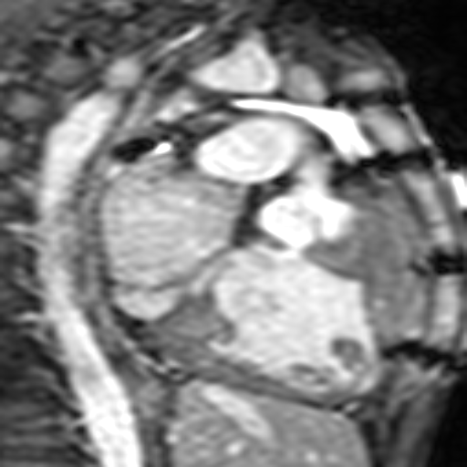</td>
<td></td>
<td>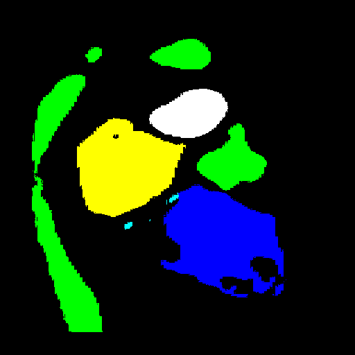</td>
</tr>
</tr>
<td>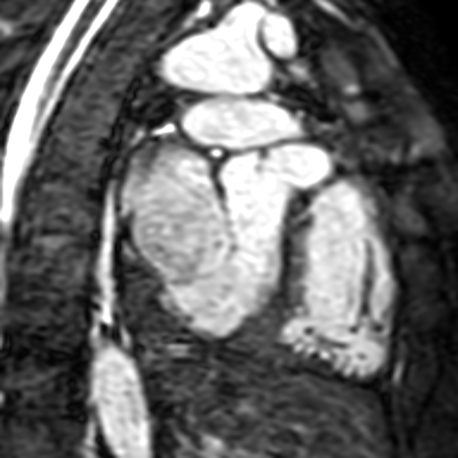</td>
<td></td>
<td></td>
</tr>
<tr>
<td>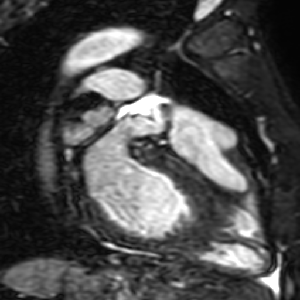</td>
<td></td>
<td></td>
</tr>
</table>

 
<h3>
1 Dataset Citation
</h3>
The dataset used here was derived from <a href="https://figshare.com/articles/dataset/HVSMR-2_0_cropped_norm_/25226363?backTo=/collections/HVSMR-2_0_A_3D_cardiovascular_MR_dataset_for_whole-heart_segmentation_in_congenital_heart_disease/7074755">
<b>HVSMR-2.0 (cropped_norm)</b> </a> in  
<a href="https://figshare.com/collections/HVSMR-2_0_A_3D_cardiovascular_MR_dataset_for_whole-heart_segmentation_in_congenital_heart_disease/7074755/2">
HVSMR-2.0: A 3D cardiovascular MR dataset for whole-heart segmentation in congenital heart disease
</a> 
  
<b>Authors</b> 
Danielle Pace, Hannah Contreras, Jennifer Romanowicz, Shruti Ghelani, Imon Rahaman, Yue Zhang, Patricia Gao, 
 mohammad imrul jubair, Tom Yeh, Polina Golland, Tal Geva, Sunil Ghelani, Andrew Powell, mehdi hedjazi moghari 
 
<b>Description</b> 
Patients with congenital heart disease often have cardiac anatomy that deviates significantly from normal, 
frequently requiring multiple heart surgeries. Image segmentation from a preoperative cardiovascular magnetic resonance (CMR) 
scan would enable creation of patient-specific 3D surface models of the heart, which have potential to improve surgical 
planning, enable surgical simulation, and allow automatic computation of quantitative metrics of heart function. However, 
there is no publicly available CMR dataset for whole-heart segmentation in patients with congenital heart disease.  
Here, we release the HVSMR-2.0 dataset, comprising 60 CMR scans alongside manual segmentation masks of the 4 cardiac  
chambers and 4 great vessels. 
 The images showcase a wide range of heart defects and prior surgical interventions.  
 The dataset also includes masks of required and optional extents of the great vessels, enabling fairer comparisons 
 across algorithms. Detailed diagnoses for each subject are also provided.  
 By releasing HVSMR-2.0, we aim to encourage development of robust segmentation algorithms and clinically relevant tools 
 for congenital heart disease.
 
 
<b>DOI </b> 
https://doi.org/10.6084/m9.figshare.c.7074755.v2
 
 
<b>License</b> 
<a href="https://creativecommons.org/licenses/by/4.0/">
CC BY 4.0
</a>
 
 
<h3>
2 Whole-Heart ImageMask Dataset
</h3>
<h4>2.1 Download PNG ImageMask Dagtaset</h4>
 If you would like to train this Whole-Heart Segmentation model by yourself,
 please download <a href="https://drive.google.com/file/d/1A59iwXEEkmAhC3iCvlzWpRFAQAEzS2CY/view?usp=sharing">
 <b>Whole-Heart-ImageMask-Dataset.zip </b></a>
on the google drive, expand the downloaded, and put it under dataset folder to be:
<pre>
./dataset
└─Whole-Heart
    ├─test
    │  ├─images
    │  └─masks
    ├─train
    │  ├─images
    │  └─masks
    └─valid
        ├─images
        └─masks
</pre>
<b>Whole-Heart Statistics</b> 
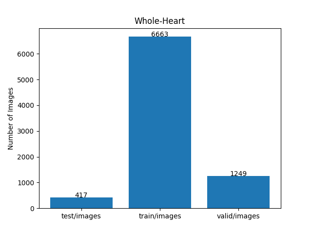 
 
As shown above, the number of images of train and valid datasets is large enough to use for a training set of our segmentation model.
  
<h4>2.2 PNG ImageMask Dataset Derivation</h4>
The folder structure of 
<b>HVSMR-2.0 (cropped_norm)</b> </a> in  
<a href="https://figshare.com/collections/HVSMR-2_0_A_3D_cardiovascular_MR_dataset_for_whole-heart_segmentation_in_congenital_heart_disease/7074755/2">
HVSMR-2.0: A 3D cardiovascular MR dataset for whole-heart segmentation in congenital heart disease
</a> dataset is the following. 
<pre>
./cropped_norm
 ├─pat0_cropped_norm.nii.gz
 ├─pat0_cropped_seg.nii.gz
 ├─pat0_cropped_seg_endpoints.nii.gz
 │  
 ... 
 ├─pat59_cropped_norm.nii.gz
 ├─pat59_cropped_seg.nii.gz
 └─pat59_cropped_seg_endpoints.nii.gz
</pre>
We used the following 2 Python scripts to generate our PNG dataset.
<ul>
<li><a href="./generator/ImageMaskDatasetGenerator.py">ImageMaskDatasetGenerator.py</a></li>
<li><a href="./generator/split_master.py">split_master.py</a></li>
</ul>

We used all <i>*_cropped_norm.nii.gz</i> and <i>*_cropped_seg.nii.gz</i> files in 60 patients <b>cropped_norm</b> folder 
 to generate the dataset, and the following class and color mapping table to generate colorized masks files for 8 classes
(4 cardiac chambers and 4 great vessels) from the <i>seg.nii.gz</i> files. 
You may change this color mapping table in the Generator Python script according to your preference.
  
<table border="1" style="border-collapse: collapse;">
<tr><th>Mask Pixel</th><th>Class</th><th>Color </th><th>RGB triplet</th></tr>
<tr>
<td>1</td><td>LV (Left Ventricle)</td><td>red</td><td>(255,0,0)</td><tr>
<td>2</td><td>RV (Right Ventricle)</td><td>blue</td><td>(0,0,255)</td><tr>
<td>3</td><td>LA (Left Atrium)</td><td>yellow</td><td>(255,255,0)</td><tr>
<td>4</td><td>RA (Right Atrium)</td><td>cyan</td><td>(0,255,255)</td><tr>
<td>5</td><td>AO (Aorta) </td><td>green</td><td>(0,255,0)</td><tr>
<td>6</td><td>PA (Pulmonary Artery)</td><td>white</td><td>(255,255,255)</td><tr>
<td>7</td><td>SVC(Superior Vena Cava)</td><td>mazenda</td><td>(255,0,255)</td><tr>
<td>8</td><td>IVC(Inferior Vena Cava)</td><td>gray</td><td>(128,128,128)</td><tr>
</table>
 
 
<h4>2.3 ImageMask Dataset Sample</h4>
<b>Train_images_sample</b> 
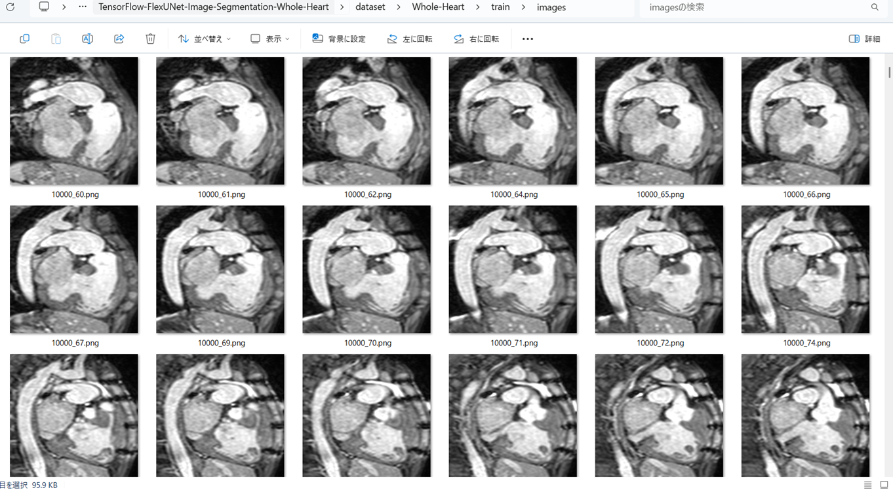
 
<b>Train_masks_sample</b> 
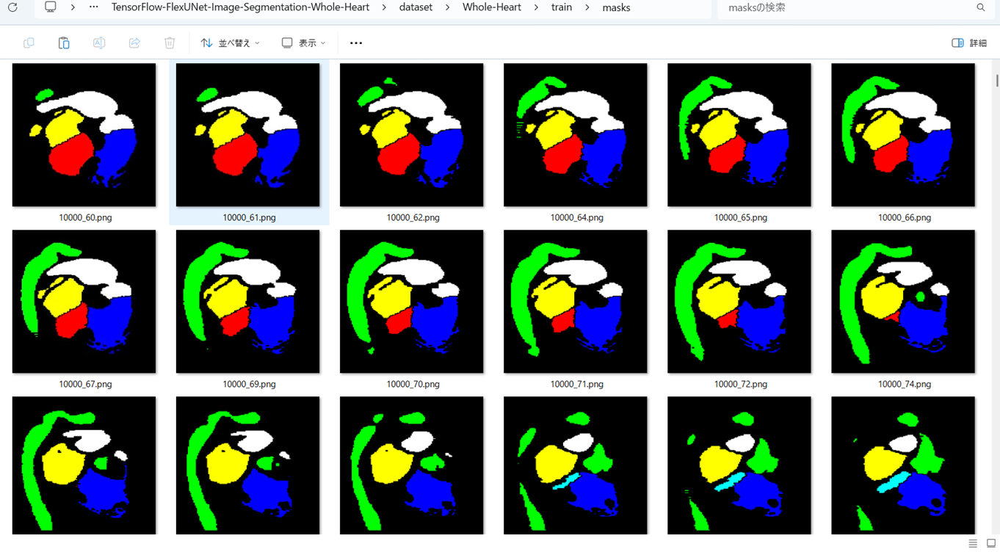
 
 
<h3>
3 Train TensorFlowFlexUNet Model
</h3>
 We trained Whole-Heart TensorFlowFlexUNet Model by using the following
<a href="./projects/TensorFlowFlexUNet/Whole-Heart/train_eval_infer.config"> <b>train_eval_infer.config</b></a> file.  
Please move to ./projects/TensorFlowFlexUNet/Whole-Heart, and run the following bat file. 
<pre>
>1.train.bat
</pre>
, which simply runs the following command. 
<pre>
>python ../../../src/TensorFlowFlexUNetTrainer.py ./train_eval_infer.config
</pre>

<b>Model parameters</b> 
Defined a small <b>base_filters = 16</b> and large <b>base_kernels = (7,7)</b> for the first Conv Layer of Encoder Block of 
<a href="./src/TensorFlowFlexUNet.py">TensorFlowFlexUNet.py</a> 
and a large num_layers (including a bridge between Encoder and Decoder Blocks).
<pre>
[model]
image_width    = 512
image_height   = 512
image_channels = 3

num_classes    = 9

base_filters   = 16
base_kernels   = (7,7)
num_layers     = 8
dropout_rate   = 0.04
dilation       = (1,1)

</pre>

<b>Learning rate</b> 
Defined a very small learning rate.  
<pre>
[model]
learning_rate  = 0.00007
</pre>

<b>Online augmentation</b> 
Disabled our online augmentation.  
<pre>
[model]
model         = "TensorFlowFlexUNet"
generator     = False
</pre>

<b>Loss and metrics functions</b> 
Specified "categorical_crossentropy" and <a href="./src/dice_coef_multiclass.py">"dice_coef_multiclass"</a>. 
You may specify other loss and metrics function names. 
<pre>
[model]
loss           = "categorical_crossentropy"
metrics        = ["dice_coef_multiclass"]
</pre>
<b>Learning rate reducer callback</b> 
Enabled learing_rate_reducer callback, and a small reducer_patience.
<pre> 
[train]
learning_rate_reducer = True
reducer_factor     = 0.5
reducer_patience   = 4
</pre>

<b>Early stopping callback</b> 
Enabled early stopping callback with patience parameter.
<pre>
[train]
patience      = 10
</pre>

<b>RGB Color map</b> 
rgb color map dict for Whole-Heart 1+8 classes.
<pre>
[mask]
mask_datatype    = "categorized"
mask_file_format = ".png"
;                     red,        blue,       yellow,        cyan,         green,     white,          mazenda,       gray
rgb_map = {(0,0,0):0,(255,0,0):1,(0,0,255):2,(255,255,0):3, (0,255,255):4,(0,255,0):5,(255,255,255):6,(255,0,255):7,(128,128,128):8,}    
</pre>

<b>Epoch change inference callback</b> 
Enabled <a href="./src/EpochChangeInferencer.py">epoch_change_infer callback (EpochChangeInferencer.py)</a></b>. 
<pre>
[train]
epoch_change_infer       = True
epoch_change_infer_dir   =  "./epoch_change_infer"
num_infer_images         = 6
</pre>

By using this callback, on every epoch_change, the inference procedure can be called
 for 6 images in <b>mini_test</b> folder. This will help you confirm how the predicted mask changes 
 at each epoch during your training process.    

<b>Epoch_change_inference output at starting (epoch 1,2,3)</b> 
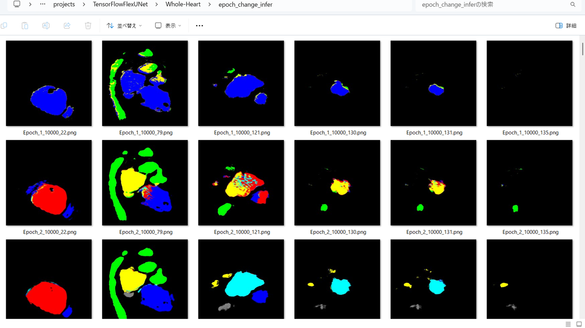 
 
<b>Epoch_change_inference output at middlepoint (epoch 28,29,30)</b> 
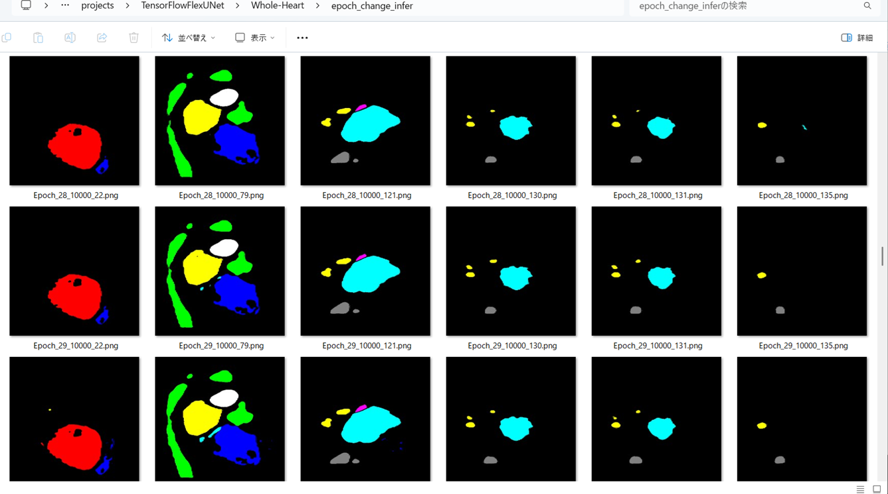 
 

<b>Epoch_change_inference output at ending (epoch 58,59,60)</b> 
 
 

In this experiment, the training process was terminated at epoch 60.  
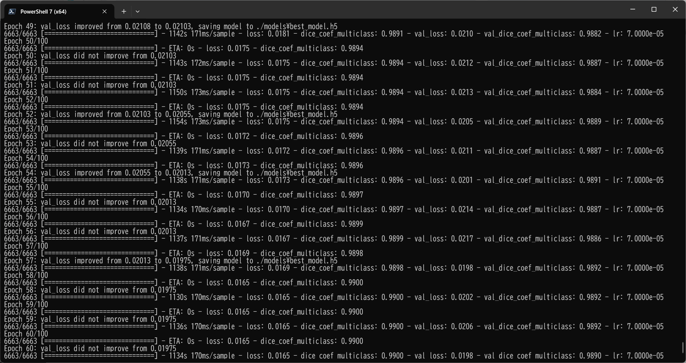 
 

<a href="./projects/TensorFlowFlexUNet/Whole-Heart/eval/train_metrics.csv">train_metrics.csv</a> 
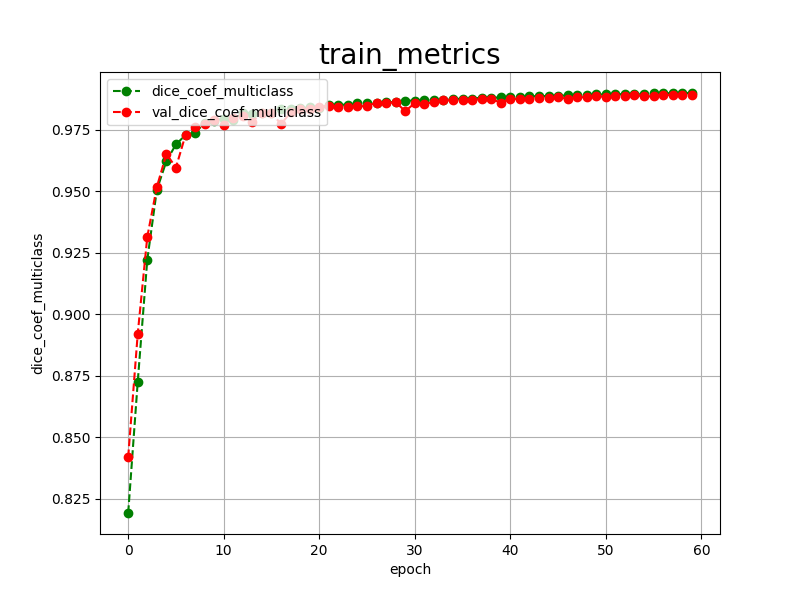 

 
<a href="./projects/TensorFlowFlexUNet/Whole-Heart/eval/train_losses.csv">train_losses.csv</a> 
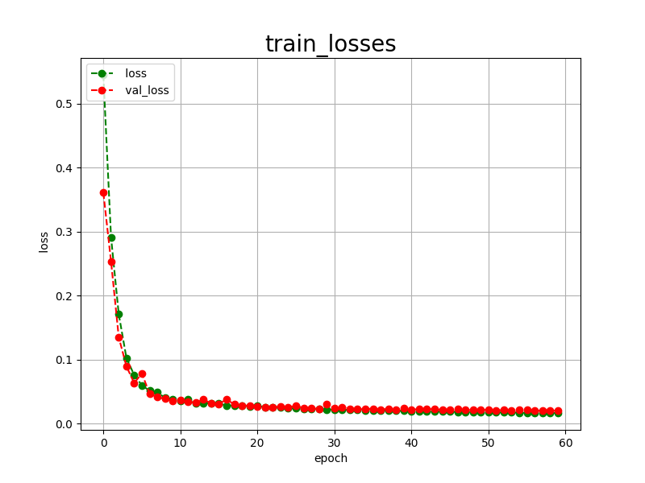 
 
<h3>
4 Evaluation
</h3>
Please move to a <b>./projects/TensorFlowFlexUNet/Whole-Heart</b> folder,
and run the following bat file to evaluate TensorFlowUNet model for Whole-Heart. 
<pre>
./2.evaluate.bat
</pre>
This bat file simply runs the following command.
<pre>
python ../../../src/TensorFlowFlexUNetEvaluator.py ./train_eval_infer.config
</pre>

Evaluation console output: 
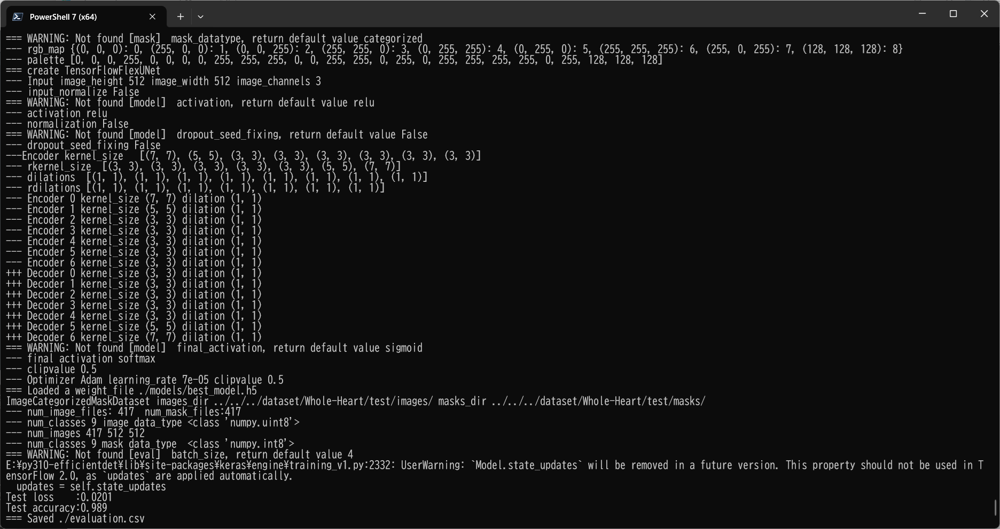
  Image-Segmentation-Whole-Heart

<a href="./projects/TensorFlowFlexUNet/Whole-Heart/evaluation.csv">evaluation.csv</a> 

The loss (categorical_crossentropy) to this Whole-Heart/test was low, and dice_coef_multiclass high as shown below.
 
<pre>
categorical_crossentropy,0.0201
dice_coef_multiclass,0.989
</pre>
 
<h3>
5 Inference
</h3>
Please move to a <b>./projects/TensorFlowFlexUNet/Whole-Heart</b> folder
, and run the following bat file to infer segmentation regions for images by the Trained-TensorFlowFlexUNet model for Whole-Heart. 
<pre>
./3.infer.bat
</pre>
This simply runs the following command.
<pre>
python ../../../src/TensorFlowFlexUNetInferencer.py ./train_eval_infer.config
</pre>

<b>mini_test_images</b> 
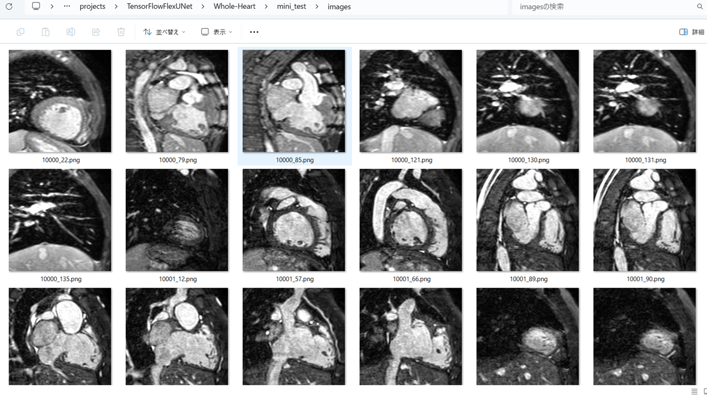 
<b>mini_test_mask(ground_truth)</b> 
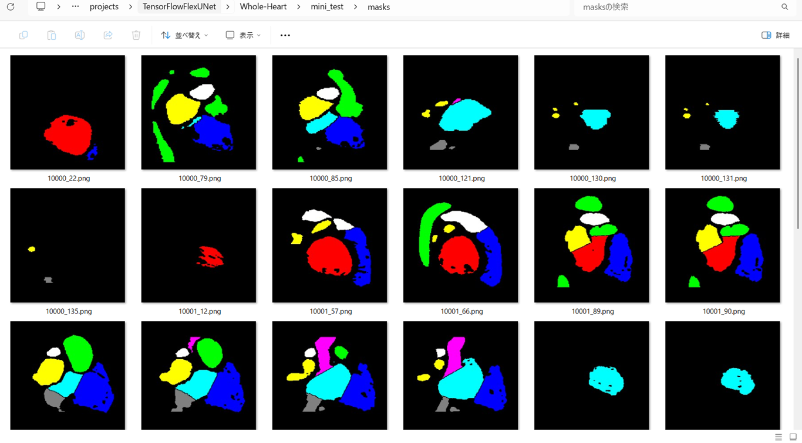 

<b>Inferred test masks</b> 
 
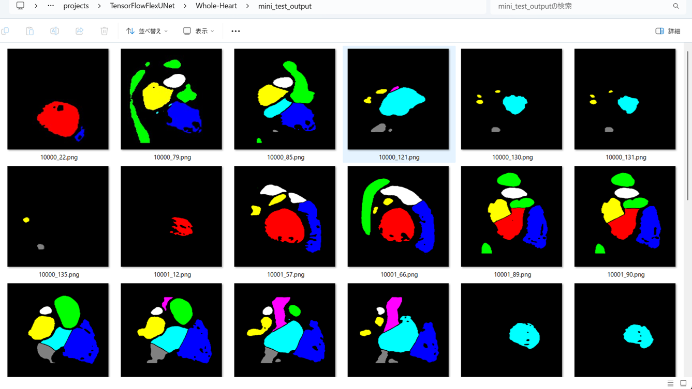 
 

<b>Enlarged images and masks for Images of 512x512 pixels </b> 
<b>rgb_map (1:red, 2:blue, 3:yellow, 4:cyan, 5:green, 6:white, 7:mazenda, 8:gray)</b>     

<table>
<tr>
<th>Image</th>
<th>Mask (ground_truth)</th>
<th>Inferred-mask</th>
</tr>

<td>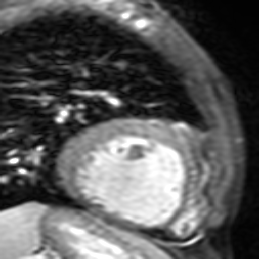</td>
<td></td>
<td></td>
</tr>
<tr>
<td></td>
<td></td>
<td></td>
</tr>
<tr>
<td>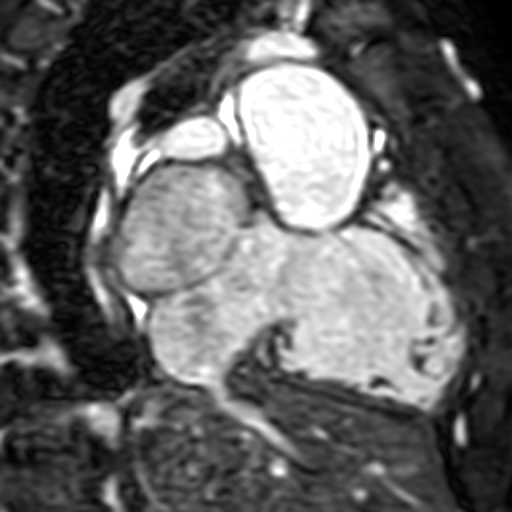</td>
<td></td>
<td></td>
</tr>

<tr>
<td>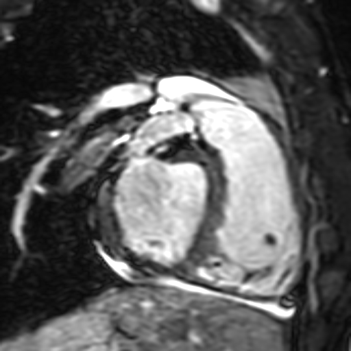</td>
<td></td>
<td></td>
</tr>
<tr>
<td>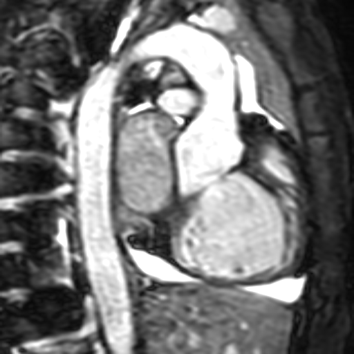</td>
<td></td>
<td></td>
</tr>
<tr>
<td></td>
<td></td>
<td></td>
</tr>
</table>

 

<h3>
References
</h3>

<b>1. HVSMR-2.0: A 3D cardiovascular MR dataset for whole-heart segmentation in congenital heart disease</b> 
Danielle F. Pace, Hannah T. M. Contreras, Jennifer Romanowicz, Shruti Ghelani, Imon Rahaman, Yue Zhang, Patricia Gao, 
 Mohammad Imrul Jubair, Tom Yeh, Polina Golland, Tal Geva, Sunil Ghelani, Andrew J. Powell & Mehdi Hedjazi Moghari 
 
<a href="https://www.nature.com/articles/s41597-024-03469-9">
https://www.nature.com/articles/s41597-024-03469-9
</a>
 
<a href="https://people.csail.mit.edu/dfpace/assets/publications/HVSMR-2.0.pdf">
HVSMR-2.0: A 3D cardiovascular MR dataset for whole-heart segmentation in congenital  heart disease</a>
 
 
<b>2.A novel hybrid layer-based encoder–decoder framework for 3D segmentation in congenital heart disease</b> 
Yaoxi Zhu, Hongbo Li, Bingxin Cao, Kun Huang & Jinping Liu 
<a href="https://www.nature.com/articles/s41598-025-96251-9">
https://www.nature.com/articles/s41598-025-96251-9
</a>
 
 
<b>3. TensorFlow-FlexUNet-Image-Segmentation-Model</b> 
Toshiyuki Arai antillia.com  
<a href="https://github.com/sarah-antillia/TensorFlow-FlexUNet-Image-Segmentation-Model">
https://github.com/sarah-antillia/TensorFlow-FlexUNet-Image-Segmentation-Model
</a>
 
 
